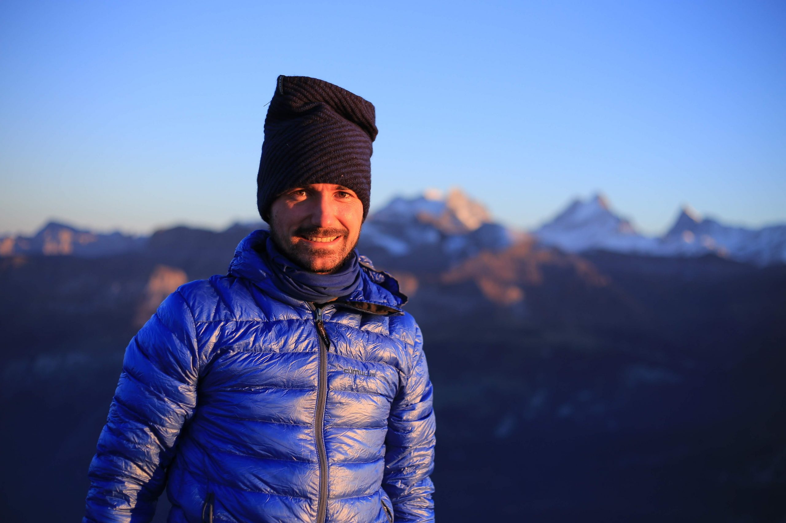

Take an active break in nature and experience …

Fantastic lake landscapes - change of perspective - fun on canoes - companionship - personal development - discovery of your capabilities, resources and motivation - cooking on the bonfire - sleeping in the outdoors - exciting encounters with colleagues of yours

We spend 3 days discovering a fantastic lake. We will carry everything we need on canoes and sleep at beautiful places at the shore. You will learn basic outdoor skills such that we can enjoy a fun and somewhat luxurious time in nature together. During this journey we dive into personal and group processes: What are my strengths and capabilities? What are my resources? What gives me energy and motivation? We tackle these questions with action-oriented and experience-oriented methods. During this active break you will be able to look at work from a wider perspective. On the fly you will also learn some basic outdoor skills.

# About Flo

Sparkling eyes, heartful laughs and clear minds looking to the future motivate me again and again to organize outdoor workshops for groups. This is why I became a freelancing outdoor trainer, after graduating from D-INFK in spring 2020. While my PhD thesis was on bio-inspired learning and optimization, I am currently fascinated in how to create environments in which people can grow, develop and contribute as they wish - in outdoor adventures, in teams, in organizations.

