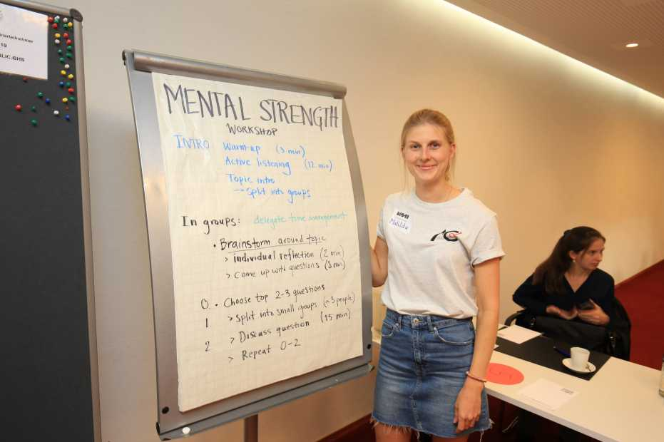

During the [ETH VMI Summer
Retreat](https://inf.ethz.ch/news-and-events/spotlights/infk-news-channel/2021/09/vmi-summer-retreat-2021.html)
the members of the organization team of the mental strength initiative
organized a series of unworkshops. They included the following topics:
- Teaching and Student Supervision
- Work-Life Balance
- Procrastination and Time Management
- Communication and Collaboration
- Imposture Syndrome
- Purpose of my Work
- Reflection on my Values and Motivation

