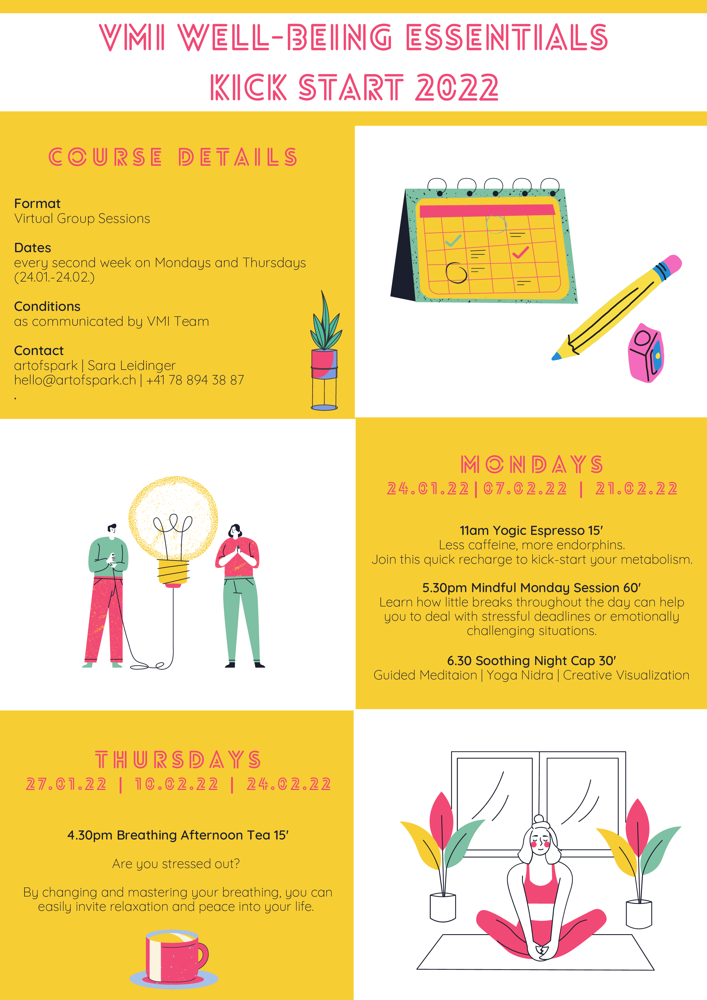

**What?**

Learn how to recharge without caffeine, react smarter under pressure and to visualize and act on what you really want.

This workshop series is designed to boost your performance and well-being by teaching you mindfulness based methods that will help you to re-energize, to initiate change and to live intentionally.
Sara Leidinger from artofspark will guide you through three biweekly sessions of well-being essentials. Biweekly, there will be a long 90 minute session and two short 15 minutes sessions. The long session teaches you meditation, yoga nidra and creative visualization. The short sessions called ‘yogic espresso’ and ‘breathing afternoon tea’ teach you how to kick-start your metabolism and how to recharge with small breaks throughout the day.

**When and where?**

Workshop sessions: Monday Jan 24, Feb 7 and Feb 21, 17:30-19:00  
Yogic espressos: Monday Jan 24, Feb 7 and Feb 21, 11:00-11:15  
Breathing afternoon tea: Thursday Jan 27, Feb 10 and Feb 24, 16:30-16:45  
Where: online; link will be sent to registered participants

**Registration?**

Participation fee: 45 CHF. Please sign-up here: [Registration](https://forms.gle/byYC7D5jEozJ4ifc9)

**Who can participate?**

All ETH D-INFK members, University of Edinburgh Students, and other people
interested in the scientific excellence and well-being initiative (external
people should pay the whole participation fee of 150 CHF or request a
reduction).

[Flyer](./WELL-BEING-ESSENTIALS-2022-VMI.pdf)
