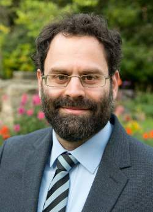

You have amazing ideas but struggle to make them shine? Ideas pop up randomly
in your head: you follow them, forget, see them pop up again? Or
do you use a diary, git repo, or org-mode file to store your ideas?  While we
(as scientists) sometimes track ideas consciously, our habits to evolve and
polish ideas are rarely deliberate. Yet, sometimes we experience the perfect
moment: a whiteboard discussion, a blog article, a deep insight while taking a
bath, ... and, suddenly, a rough idea turns into a polished insight. Somehow,
we seem to know how to develop exquisite ideas!

In this unworkshop, we will crowd-source best practices of how to evolve
ideas. By playing small and interactive games, we identify the critical steps
that we take when working with ideas. Together, we transform these small
ideas into 'science games', small deliberate activities which we can
experience, practice, and use deliberately whenever we encounter a new rough
idea that may need some polishing.

Join us for an experimental afternoon and play the science game with us.

Please register here: [https://doodle.com/meeting/participate/id/aKrLowre](https://doodle.com/meeting/participate/id/aKrLowre)

## Your Hosts

**Will Naameh alias MC Hammersmith**

[Will Naameh](willnaamehimprov.com) is an improv theater artists from Edinburgh. He started performing improv in 2006. Originally from London, he has been based in Edinburgh since 2010.

He has trained in improv with some of the world's leading schools and instructors, including Second City, iO Chicago, UCB, Annoyance Theatre, Susan Messing, Keith Johnstone, TJ & Dave and The Groundlings.

He currently performs with multi award-winning improv troupe The Spontaneous Players, known for their Edinburgh Fringe smash hit show Spontaneous Potter.

As a solo act, he performs improvised hip hop comedy under the rap name [MC Hammersmith](https://www.mchammersmith.com/). In this guise he has won multiple Scottish Comedy Awards, headlines comedy clubs across the UK and internationally, and has supported Jason Manford and John Bishop on tour.

He is a former UK Improv Smackdown Champion and has taught improv for groups, individuals, corporations and festivals worldwide.

**Alexander Viand**

When he isn't visiting UoE, [Alexander Viand](https://pps-lab.com/people/alexanderviand/) is a PhD student at ETH Zurich. There, he's active in the scientific staff association (VMI) and had the pleasure to help coordinate the [Scientific Excellence & Well-Being initiative](http://vmi.ethz.ch/wellbeing/). His research focuses on making advanced cryptographic techniques such as Fully Homomorphic Encryption accessible to non-experts by developing new systems, tools and abstractions.

**Ohad Kammar**

[Ohad Kammar](https://www.denotational.co.uk/) is a Senior Research Fellow at
the University of Edinburgh School of Informatics, and his interests include
programming languages and applied mathematics (category theory, logic,
algebra).

**Tobias Grosser**

Tobias keeps wondering: "what makes great science"? On his way to answering this
question, Tobias co-founded the [Scientific
Excellence & Well-Being initiative](http://vmi.ethz.ch/wellbeing/) initiative and
continues along his quest to demonstrate that focusing "putting the human first"
is not just healthy, but yields excellent scientific results. Tobias leads a
[research group on compiler design](https://grosser.science) at the University
of Edinburgh, where he researches how compilers -- in the broadest sence -- ought
to be designed in the future.

